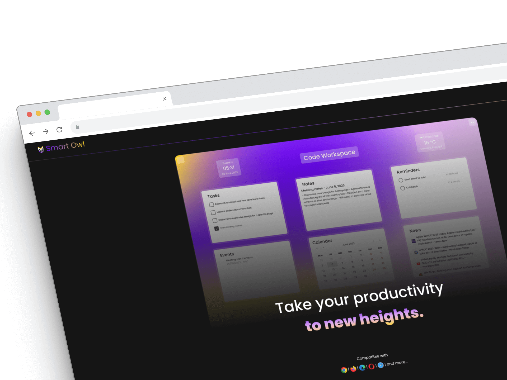

# SmartOwl

## Academic Project

## Description

Project to **"Multimedia Project"** curricular unit of my degree:\
Platform designed to be a browser homepage. With SmartOwl you can create multiple workspaces (p.e. personal, work, etc...) and read news, take notes, add reminders and save events.\
This app use Firebas to sync your data inside the app.

## Technologies Used

- HTML
- CSS
- JavaScript
- React
- [Radix UI](https://rawg.io/apidocs)
- [CMDK](https://cmdk.paco.me/)
- [Lottie Files](https://lottiefiles.com/pt/)
- [Beautiful Drag N' Drop](https://react-beautiful-dnd.netlify.com/)
- [React-Calendar](https://projects.wojtekmaj.pl/react-calendar/)
- [Bootstrap](https://getbootstrap.com/)
- API Integration [NewsAPI](https://newsapi.org/)

## Features and Functionality

- Application with CRUD
- Creation of workspaces
- Read News
- Take notes
- Save events
- Add reminders
- Command bar
- Google search bar
- Cross-browser compatibility

## Usage Instructions

- Soon

## Contact
Name: Fernando Apóstolo
Email: fernandodaniel.work@gmail.com
LinkedIn: https://www.linkedin.com/in/fernando-apostolo
Website: https://www.nandodani.github.io
